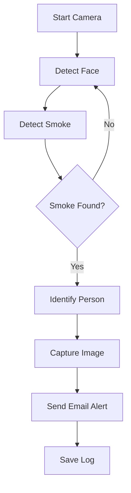

# 🔥 Smoke Detection System with Face Recognition

<p align="center">
  <b>Real-Time AI-Based Smoke Detection 🚭 | Face Recognition 👤 | Email Alerts 📧</b>
</p>

<p align="center">
  
  
  
  
</p>

---

## 📌 Project Overview

This project is an **AI-powered Smoke Detection System** that monitors live video feed using a webcam and detects smoking activity in real-time.

It integrates:

* 🔍 Deep Learning for smoke detection (YOLO ONNX model)
* 👤 Face Recognition to identify individuals
* 📧 Email alert system with captured evidence
* 🖥️ GUI-based interface using Tkinter

---

## 🎯 Key Features

✨ Real-time smoke detection
✨ Face recognition-based identification
✨ Automatic email alerts with image proof
✨ Admin & User login system
✨ Smoke detection logs with date & time
✨ GUI interface for easy interaction

---

## 🧠 System Workflow



---

## 🛠️ Tech Stack

| Technology  | Usage            |
| ----------- | ---------------- |
| Python      | Core Programming |
| OpenCV      | Video Processing |
| NumPy       | Data Handling    |
| Tkinter     | GUI Interface    |
| PIL         | Image Processing |
| ImageHash   | Face Matching    |
| YOLO (ONNX) | Smoke Detection  |
| SMTP        | Email Alerts     |

---

## 📂 Project Structure

```bash
.
├── home.py
├── nm.onnx
├── train/
├── fine/
├── frame/
├── images/
├── data/haarcascades/
├── ar_master.py
└── README.md
```

---

## ▶️ Installation & Setup

### 🔹 Step 1: Clone Repository

```bash
git clone https://github.com/ssalmaanrusti-ind/smoke-detection-system.git
cd smoke-detection-system
```

### 🔹 Step 2: Install Dependencies

```bash
pip install opencv-python numpy pillow imagehash
```

### 🔹 Step 3: Run the Project

```bash
python home.py
```

---

## 📧 Email Alert System

When smoke is detected:

* 📸 Captures image
* 👤 Identifies user
* 📅 Adds timestamp
* 📧 Sends alert to:

  * User
  * Admin (Head)

---

## 🔐 User Roles

### 👨‍💼 Admin (Head)

* Add Users
* View Users
* Monitor Smoke Logs

### 👤 User

* Login
* View personal detection history

---

## ⚠️ Requirements

* Webcam 📷
* Python 3.x
* Internet connection 🌐

---

## 🚀 Future Enhancements

* 🔥 Improve detection accuracy
* 🌐 Convert to web application
* 📱 Mobile app integration
* 📊 Live monitoring dashboard

---

## 👨‍💻 Author

    S.SALMAAN RUSTI

---

## ⭐ Show Your Support

If you like this project:

🌟 Star this repository
🍴 Fork it
🛠️ Contribute

---

## 📜 License

This project is for educational purposes only.
